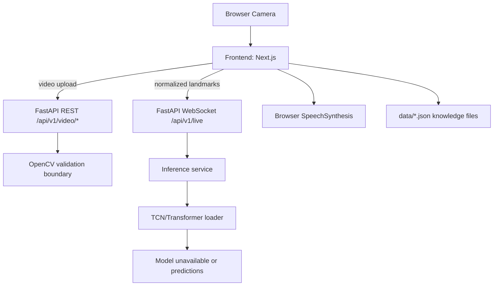

# Architecture

```mermaid
flowchart TD
  Cam[Browser Camera] --> FE[Frontend: Next.js]
  FE -->|normalized landmarks| WS[FastAPI WebSocket /api/v1/live]
  FE -->|video upload| API[FastAPI REST /api/v1/video/*]
  API --> VAL[OpenCV validation boundary]
  WS --> INF[Inference service]
  INF --> ML[TCN/Transformer loader]
  ML --> OUT[Model unavailable or predictions]
  FE --> TTS[Browser SpeechSynthesis]
  FE --> KB[data/*.json knowledge files]
```
