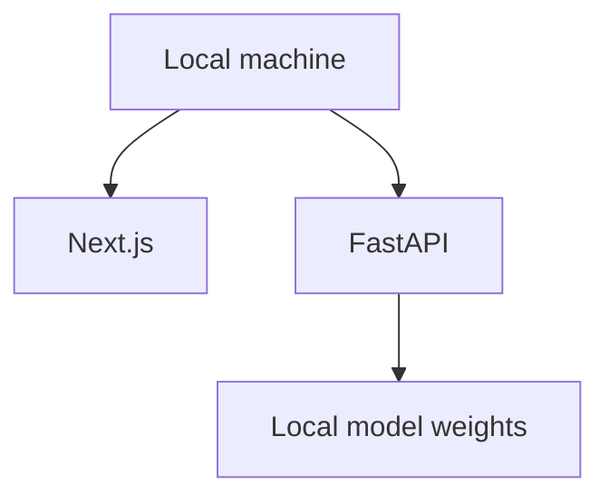

# Deployment

Current target is local-first development. Optional `docker-compose.yml` starts frontend and backend for local orchestration. Cloud/edge deployment is future work after model and dataset readiness.

