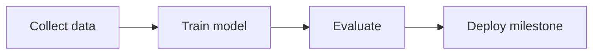

# Future Roadmap

1. Integrate MediaPipe Tasks Vision assets in frontend.
2. Collect verified real-world datasets for selected labels.
3. Train and validate temporal models.
4. Add phrase builder with confidence-aware buffering.
5. Expand verified cultural knowledge coverage.

