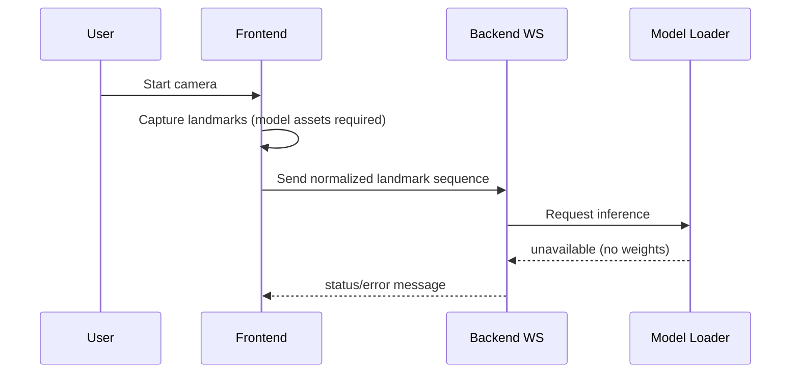

# Live Inference

```mermaid
sequenceDiagram
  participant U as User
  participant FE as Frontend
  participant WS as Backend WS
  participant M as Model Loader
  U->>FE: Start camera
  FE->>FE: Capture landmarks (model assets required)
  FE->>WS: Send normalized landmark sequence
  WS->>M: Request inference
  M-->>WS: unavailable (no weights)
  WS-->>FE: status/error message
```
