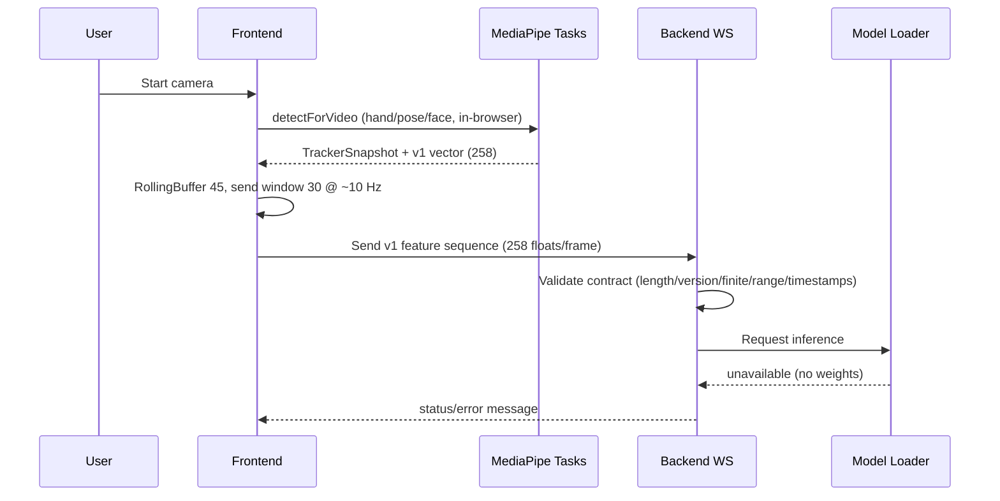

# Live Inference

## Feature schema v1

- `feature_version: v1`, `feature_count: 258` per frame.
- `[0:63]` left hand 21 x (x, y, z); `[63:126]` right hand 21 x (x, y, z);
  `[126:258]` pose 33 x (x, y, z, visibility).
- Face landmarks are overlay/diagnostics only and excluded from the vector.
- Anchors: mid-shoulders origin + shoulder-width scale when pose is present,
  else wrist-relative hands. Missing parts are zero-filled with flags.
  Every frame carries `timestamp_ms`; sequences carry version/count metadata.
- Raw video frames are never sent; only normalized vectors go over the socket.
- Backend validates the formal v1 contract (`FeatureFrame`/`FeatureSequence`
  in `backend/app/schemas.py`: exact length 258, version/count match, finite
  values, `[-10, 10]` range with `[0, 1]` visibility slots, non-negative
  monotonic timestamps, 1–240 frames) and still replies `model-unavailable`
  until trained weights are installed.
