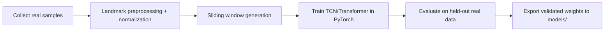

# Model

Implemented:
- `BaseTemporalModel`
- `TCNModel`
- `TransformerModel` (swappable skeleton)
- `load_model_if_available()` explicit unavailable status, safe
  `weights_only=True` loading, and v1 checkpoint metadata checks
  (`architecture`, `input_size`, `num_classes`, `feature_version`,
  `feature_count`, `label_mapping`)

No pretrained weights are committed in `models/`. Future checkpoints must
carry the metadata above with `feature_version: v1` and
`feature_count: 258`; mismatches load as `unavailable`, never as predictions.

No pretrained weights are committed in `models/`.

## Frontend feature schema v1 (frozen for training)

- `feature_version: v1`, `input_size: 258` (matches `configs/model.example.yaml`).
- Layout: left hand 63 + right hand 63 + pose 132 = 258 floats/frame.
- Face landmarks are tracked for overlay/diagnostics only and MUST NOT be
  included in the TCN vector. A face-inclusive layout requires a deliberate
  v2 schema + retraining; do not start training until v1 is stable.

## Training flow

